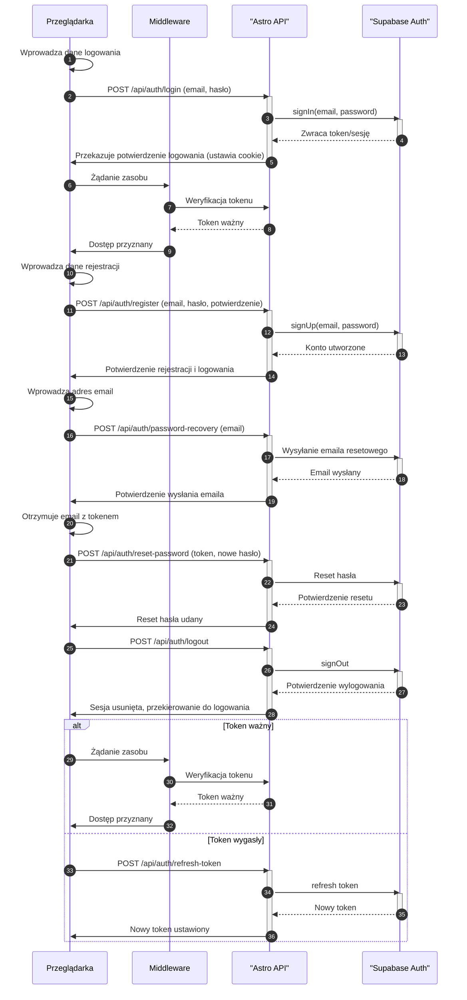

<authentication_analysis>
Analiza autentykacji:

1. Przepływy: Logowanie, Rejestracja, Odzyskiwanie hasła, Wylogowanie, Odświeżanie tokenu.
2. Aktorzy: Przeglądarka, Middleware, Astro API, Supabase Auth.
3. Weryfikacja: Po logowaniu token jest dołączany do cookies, a middleware weryfikuje token przy każdym żądaniu.
4. Opis kroków:
   - Logowanie: Formularz logowania -> API -> Supabase -> zwrot tokenu i utworzenie sesji.
   - Rejestracja: Formularz rejestracji -> API -> Supabase -> utworzenie konta i logowanie.
   - Odzyskiwanie hasła: Formularz odzyskiwania -> API -> Supabase -> wysłanie emaila resetowego, następnie reset hasła.
   - Wylogowanie: Żądanie wylogowania -> API -> Supabase -> usunięcie sesji.
   - Odświeżanie tokenu: W przypadku wygaśnięcia tokenu, API inicjuje proces odświeżania poprzez Supabase.
     </authentication_analysis>

<mermaid_diagram>

</mermaid_diagram>
